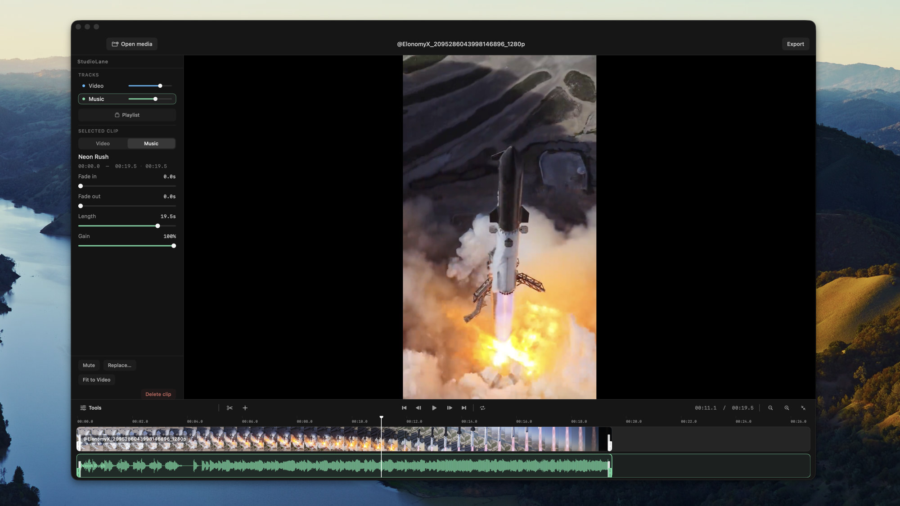

# StudioLane

A native macOS studio for cutting picture and sound together. Bring in a recording, lay music under it, trim and mix until both are clear, then export a finished movie.

Requires macOS 14 or later.

## Download

[StudioLane 1.1](https://github.com/maxkongerskov/StudioLane/releases/download/v1.1/StudioLane-1.1.dmg) is a disk image for macOS 14 or later. Open it and drag StudioLane into Applications.

The app is signed with Max Køngerskov’s Developer ID and notarized by Apple. Open the disk image and drag StudioLane into Applications.



## What you can do

The editor opens empty, or restores the last session. Drop video or audio on the preview, or choose File ▸ Open Media. Video lanes show a filmstrip. Audio lanes show a waveform. Add more lanes when one picture track and one music track are not enough.

Clips can be trimmed, split at the playhead, moved, and duplicated. Each clip has a fade in, a fade out, and its own gain. Each lane has a volume, and a clip can be muted on its own. Playlist layout lines music up end to end. Layer layout lets clips overlap. Ducking pulls the music down under the recording.

Play and scrub from the timeline. Zoom in without losing the lanes. Undo and redo follow the edits. Save a `.salproject`, or leave the session to autosave. Export an MP4, MOV, or M4V, including H.264, HEVC, and ProRes.

## Run

Build the app and open it:

```bash
cd ~/Projects/StudioAudioLane
./scripts/launch.sh
```

That writes `.build/StudioAudioLane.app` and launches it. The window opens at 1568×780, and can shrink to 1100×620.

To put a copy in `/Applications`:

```bash
./scripts/install.sh
```

## Everyday controls

| Action | Shortcut |
| --- | --- |
| Open media | ⌘O |
| Save project | ⌘S |
| Export | ⌘E |
| Play / pause | Space |
| Split at playhead | S |
| Duplicate clip | ⌘D |
| Delete clip | Delete |
| Undo | ⌘Z |
| Redo | ⇧⌘Z or ⌘Y |
| Previous / next music clip | ⌥← / ⌥→ |

Mark in, mark out, and loop live in the Audio menu. Fit to Video, Replace, and the fades sit on the selected clip.